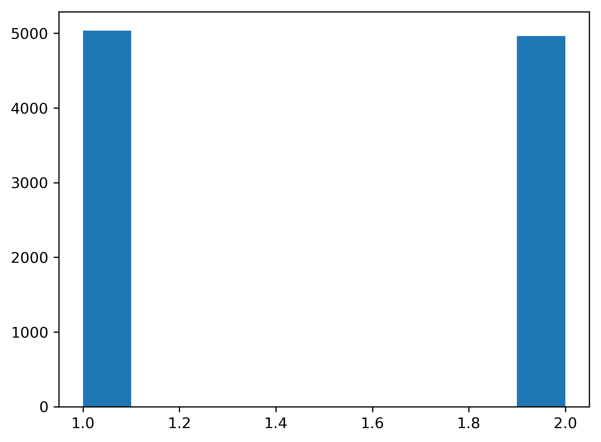

<script type="text/javascript" async
  src="https://cdnjs.cloudflare.com/ajax/libs/mathjax/2.7.4/latest.js?config=TeX-MML-AM_CHTML">
</script>

I want to just quickly note down some simple mental models, concerning Bayes rule and probabilility axioms.
These have been helpful in more involved work. Before going into Bayes rule, we first need to consider how we interpret symbols
like: $$P(K=k)$$, and $$P(K=k|V=v)$$. But before we do even that, let's get the algebra out of the way. 

$$P(A,B,C,D) = P(A|B,C,D)P(B,C,D)$$

$$ = P(C,A|B,D)P(B|D)P(D)$$ 

$$ = P(D|A,B,D)P(A|B,D)P(B,D)$$

if this is clear and obvious to you great, but if you're rusty or just starting to get to know these manipulations and the
above don't make complete sense, my only advice is to practice working with them. Google the chain rule of probability and play
with different examples, it's a relatively easy hump to get over(if a hump at all)! So why am I talking about the chain rule
when the post is clearly named Bayes rule? Consider the below:

$$P(A,B) = P(B|A)P(A) = P(A|B)P(B)$$

$$P(B|A)P(A) = P(A|B)P(B)$$

$$P(B|A) = \frac{P(A|B)P(B)}{P(A)}$$

$$P(A|B) = \frac{P(B|A)P(A)}{P(B)}$$

and for any of the above:

$$P(B) = \int P(B|A)P(A) \mathop{dA}$$

the same holds the other way around to get the marginal $$P(A)$$. So, to beat a dead horse, we see that if we have the joint probability over two random variables (really over $$N$$ random variables, but we'll stick with 2 for now), we can factor this in two ways, by applying the chain rule. Then we can equate those two different ways to one another and divide by one of the marginals to get the result we'd have if we were to apply Bayes rule to the conditional that is left over. With the aglebra out of the way I want to get back to the main point which is interpreting these symbols. Some people will say, don't bother with this nonsense, these things are just symbols. You apply some manipulations according to the rules of algebra and then compute what the resulting manipulations tell you, and that is all. I'm not one of those people, although I don't think all sybmols warrent this type of interpretation and "meaning" assignment. I do however believe it is certainly helpful for some cases.   

Alright, so, $$P(A)$$, well $$A$$ is a random variable and it takes on values, $$A=a$$  or $$A=(ladsjflejf)$$, or what not. $$P()$$ is a probability function applied to the random variable and it says there is some value between zero and one assigned to the different outcomes that $$A$$ can take (and also consider the probability axioms here, like non negativty and the requirement to sum to one). 

Cool so, what is $$P(A,B)$$ ? Well it's the same thing except now $$A$$ can take on a value and $$B$$ can take on a value and the result of applying the probability function has to agree with the axioms of probability. If you were to then use the chain rule and set:

$$P(A,B) = P(A|B)P(B)$$

how then should you think about 

$$P(A|B)$$

The answer here is the same exact way that you would think about $$P(X)$$. To make this clear I want to rewrite that function like so:

$$P(A|B) = P_{B}(A)$$ 

in words, the conditional probability of $$A$$ given $$B$$ is not to be read as: here I have my probility function $$P()$$ and I'm going to give it as input $$A$$ given $$B$$, **NO**. Instead you read it as: I have a probability function over $$A$$, I've incorportated some information, here $$B$$, and that has changed the result of my probability function, but it is still only a probability function over the random variable $$A$$. Alright alright, so why do I think it's important to keep this in mind? I guess this has to do with my own limitations, most probability I'm just not clever enough so that I immediatly appreciated the significance of these statements. But also, here's a practical setting where keeping this in mind might help us reason about the meaning of things. Consider a some observed outcome that we'll call $$Y=y$$. This outcome comes about from a series of operations, things that happen, which we'll call the generative process. Below I'm  creating some arbitrary generative process:

$$\psi=0.5$$

$$J \sim Bernoulli(\psi)$$

$$y = J + 1$$

to make it concrete let's write a program and plot what the distribution of $$y$$ looks like:

```julia
using Distributions
using PyPlot

function gen_process(psi)
    1 + Int64(rand(Bernoulli(psi)))
end

empirical_dist = [gen_process(0.5) for i in 1:10000];
plt.hist(empirical_dist)
```



That seems to be as expected. If we want to write down some statements about this process say: 

$$P(Y=1|J, \psi)$$

what is this? Hopefully it makes sense that the distribution of $$y$$ is a Bernoulli distribution. Also we see that it doesn't really make sense to say: "what is the probability of $$Y=1$$, some Bernoulli distributed random variable and this constant $$\psi$$?" rather, it's **given that** $$J$$ is Bernoulli distributed with probability $$\psi$$, what is the probability that $$Y=1$$


Cool, now to use Bayes rule, and ask the question what is the probability that the outcome of $$J$$ was 1?:

$$P(J=1 | Y=2, \psi=0.5) = \frac{P(Y | J, \psi) P(J | \psi)}{\sum\limits_{j \in J}P(Y | J, \psi) P(J | \psi)}$$

to break this down peice by peice, the distribution of $$J$$ is Bernoulli with probability $$\psi=0.5$$, and the distribution of $$Y$$ is also Bernoulli with probability (of the outcome equaling 1) 0.5. So the above turns into:

$$\frac{0.5^2}{0.5^2 + 0.5^2} = 0.5$$

**will complete this shorty, with the actual math that is going on above, instead of just saying X is a Y distributed**
